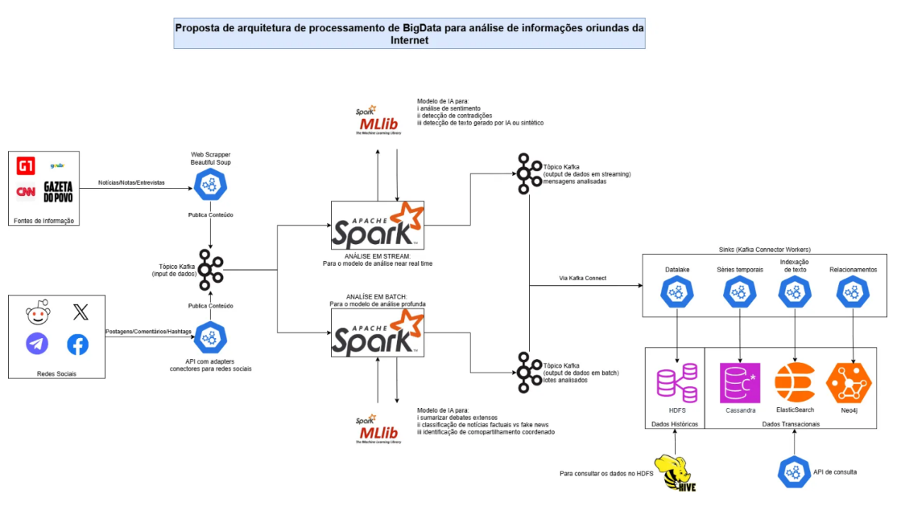

# 📡 Observatório Digital: Arquitetura Big Data para Monitoramento de Redes Sociais

> **Status:** Proposta de Arquitetura (Design Doc) | **Contexto:** Pós-Graduação em Inteligência Artificial Aplicada (UFPR)

Este repositório documenta a proposta de uma **Arquitetura Lambda** completa para ingestão, processamento e análise de grandes volumes de dados de redes sociais, com foco no combate à desinformação e detecção de redes de bots.

---

## 🏛️ Visão Geral da Arquitetura

O projeto foi desenhado para lidar com os desafios dos "3 Vs" do Big Data (Volume, Velocidade e Variedade), utilizando um pipeline híbrido que permite tanto análises em tempo real quanto processamento histórico profundo.

*(Diagrama conceitual do fluxo de dados: Ingestão -> Kafka -> Spark -> Bancos Especializados)*

---

## 🛠️ Stack Tecnológica

A solução integra ferramentas do ecossistema Hadoop e NoSQL para resolver problemas específicos de modelagem de dados:

### 1. Camada de Ingestão (Ingestion Layer)
* **Web Scrapers (Python/Selenium):** Coleta ativa de dados de redes sociais (Twitter/X, Facebook, Instagram).
* **Apache Kafka:** atua como *Message Broker* de alta vazão, garantindo o desacoplamento entre coletores e consumidores e evitando perda de dados em picos de tráfego.

### 2. Camada de Processamento (Processing Layer - Lambda)
* **Speed Layer (Apache Spark Streaming):** Processamento de baixa latência para higienização inicial, filtragem de duplicatas e alertas em tempo real.
* **Batch Layer (Apache Spark):** Processamento distribuído pesado sobre o histórico completo (HDFS), responsável pelo treinamento de modelos de Machine Learning e reprocessamento de views.

### 3. Camada de Armazenamento e Serviço (Serving Layer)
Utilizamos uma abordagem de **Persistência Poliglota**, escolhendo o banco de dados ideal para cada tipo de pergunta:

| Tecnologia | Função no Projeto |
| :--- | :--- |
| **HDFS** | *Data Lake*. Armazenamento bruto e barato de todo o histórico para auditoria e reprocessamento. |
| **Neo4j** | **Banco de Grafos**. Essencial para mapear relações (quem segue quem, quem retuíta quem) e detectar comunidades de bots. |
| **ElasticSearch** | **Busca Textual**. Indexação de milhões de postagens para busca full-text e análise de tendências de termos. |
| **Cassandra** | **Séries Temporais**. Armazenamento colunar otimizado para métricas de volume de postagens ao longo do tempo. |

---

## 🧠 Inteligência Artificial e Análise
O pipeline alimenta módulos de Machine Learning utilizando **Spark MLlib** para:
* **Análise de Sentimento:** Classificação de postagens (Positivo/Negativo/Neutro) em escala.
* **Detecção de Bots:** Identificação de contas anômalas baseada em padrões de grafos (Neo4j) e comportamento temporal.

---

## 📄 Documentação Completa
O detalhamento técnico, justificativas de escolha das ferramentas e referências teóricas estão disponíveis no artigo completo:
* [📄 Ler o Artigo Completo (PDF)](/docs/Trabalho_IAA_010_Lucas_de_Castro_Lucas_Sorrentino.pdf)

---

## 👥 Autores
* **Lucas Sorrentino** - [GitHub](https://github.com/lucasmsorrentino)
* **Lucas de Castro** - [GitHub](https://github.com/lcastrooliveira)
